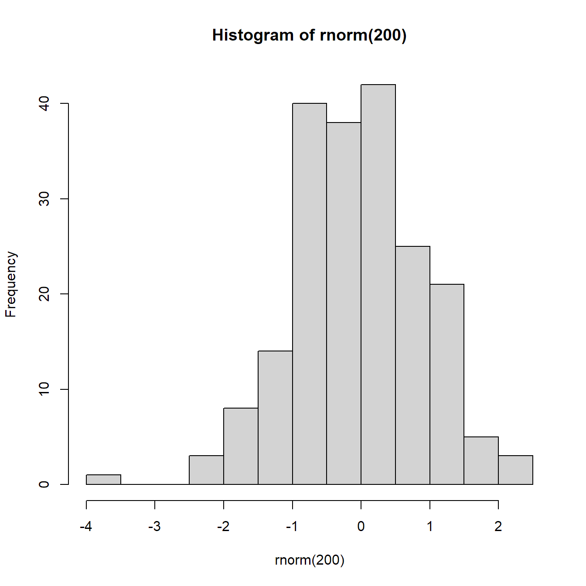

::::{.cr-section}

# Test other sticky block types

First paragraph.

::: {}
Welcome to my scrollytelling story. 
:::

:::{focus-on="cr-pink"}
This is an test site.
:::


::::

::::{.column-screen-inset style="background-color: #dddddd; padding: 50px;"}
Here's a little non-scrolling interlude before our next scrolly section!
::::

::::{.cr-section}

This is a scatterplot. @cr-scatter

:::{#cr-scatter}

::: {.cell}
::: {.cell-output-display}
{width=672}
:::
:::

:::

This is a histogram. @cr-hist

:::{#cr-hist}

::: {.cell}

```{.r .cell-code}
hist(mtcars$mpg)
```

::: {.cell-output-display}
{width=672}
:::
:::

:::

This is a poem. It's called ["Bellringer", by Rita Dove](https://www.newyorker.com/culture/2019-in-review/our-year-in-poems). @cr-intro

| {#cr-intro .cr-text  .scale-to-fill}
| Across the [268,597 square miles of Texas]{#cr-h1} access to women’s healthcare is deeply
| uneven. Large regions of the state function 
| as [“healthcare deserts,”]{#cr-h2} 
| where high- population communities have few or sometimes no access to nearby
| clinics providing essential services
| like contraception, cancer screenings, and preventive care. Underfunding,
| clinic closures,and restrictive and changing policies have widened these gaps,
| leaving low-income, rural,
| and underserved Texans facing [long travel distances]{#cr-b1}, 
| limited transportation options, and
| months-long wait times. These barriers make timely, 
| comprehensive healthcare out of reach
| for many, underscoring the urgent need for solutions that meet people where they are.
| That’s where mobile health care units come in


The author refers to their birth twice: one here... [@cr-intro]{hlz="cr-h1,cr-h2"}

... and again, further down. [@cr-intro]{hlz="cr-b1,cr-b2"}

Let's look at a small limerick. @cr-mylimerick

| {#cr-text .cr-text}
| The limerick packs [big test]{#cr-text1}
|   In space that is quite economical.

The phrase 'highlight this' is quite important here! [@cr-text]{hlz="cr-text1"}


:::{#cr-map}

::: {.cell}
::: {.cell-output-display}

```{=html}
<div id="htmlwidget-4df8a02cd82ef6e1390a" style="width:66vw;height:100vh;" class="leaflet html-widget"></div>
<script type="application/json" data-for="htmlwidget-4df8a02cd82ef6e1390a">{"x":{"options":{"crs":{"crsClass":"L.CRS.EPSG3857","code":null,"proj4def":null,"projectedBounds":null,"options":{}}},"calls":[{"method":"addProviderTiles","args":["CartoDB.DarkMatter",null,null,{"errorTileUrl":"","noWrap":false,"detectRetina":false}]}],"setView":[[31,-99],5,[]]},"evals":[],"jsHooks":[]}</script>
```

:::
:::

:::
This is a mermaid diagram @cr-map

::: {focus-on="cr-map"}
Map 1 is active here.


:::


::::

# The End
